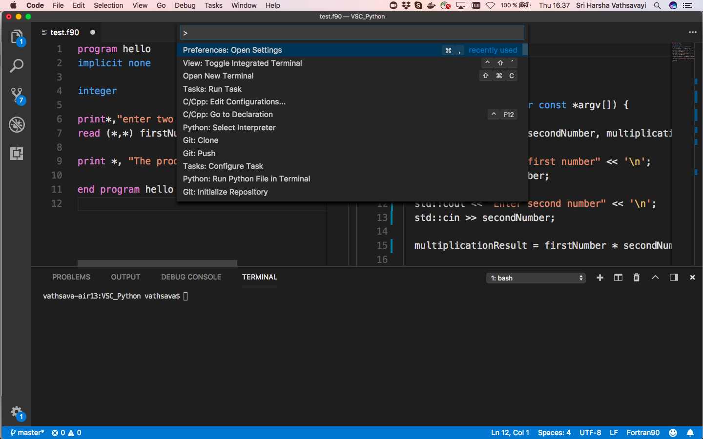
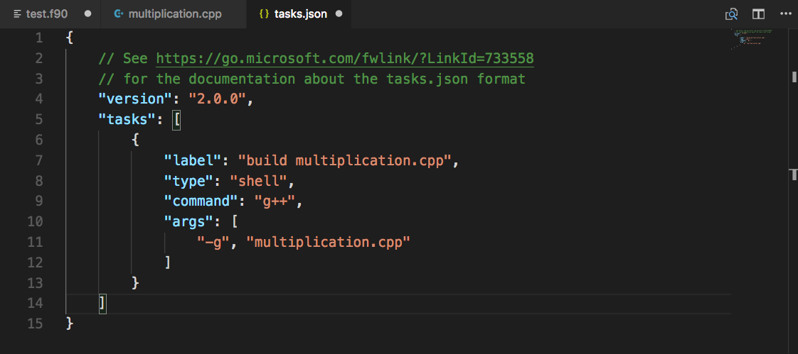
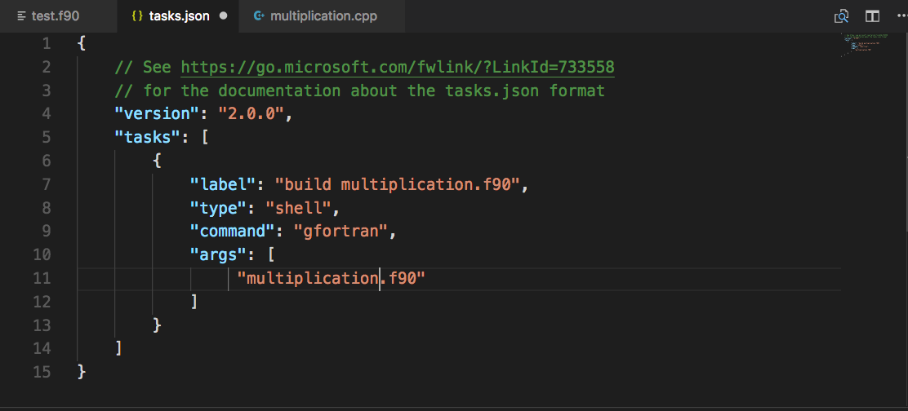
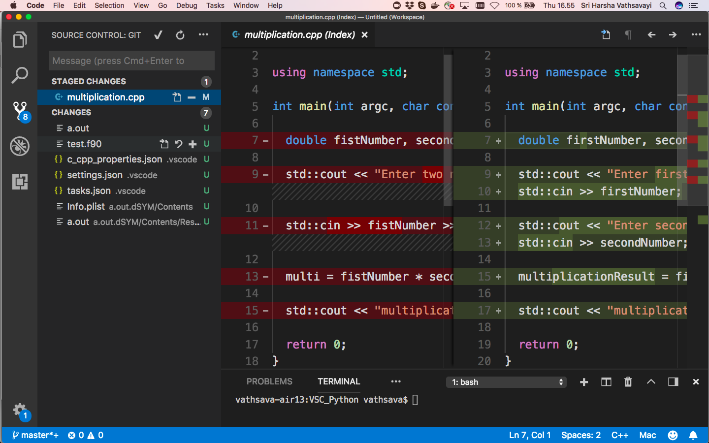

## Questions

- What tools do you use for developing code?
- How do you compile or execute the code?
- How do you debug the code?
- How do you rename a function or variable across the entire project?
- How do you search for files that uses a function or class?
- Is choosing right tools important?

## General workflow in developing code

- Writing the code
- Compiling the code
- Executing the code
- Debugging the code
- Tracking the code with version control
- Searching files, functions, classes, etc

## Tools available for developing code

- Terminal-based text editors for writing code (e.g. vi/vim, nano, emacs, etc)
- Command line tools
     - for compiling code (e.g. gcc, GFortran, javac, etc)
     - for executing code (e.g. python and java command line interpreters, etc ) 
     - for debugging code (e.g. [gdb](https://www.gnu.org/software/gdb/), [pdb](https://docs.python.org/3/library/pdb.html), [jdb](https://docs.oracle.com/javase/7/docs/technotes/tools/windows/jdb.html), etc)
     - for version control (e.g. git)   

- Text-based code editors (e.g. [sublime text](https://www.sublimetext.com/), [Atom](https://atom.io/), [Visual Studio Code](https://code.visualstudio.com/))

- Integrated development environments (IDE's) brings you "everything" you need to be a productive programmer to your finger tips 
    - IDEs are developed to maximize programmer productivity 
    - IDE is a self-contained package that allow you to write, compile, execute and debug code in the same place
    - IDE examples: [Netbeans](https://netbeans.org/), [Eclipse](https://www.eclipse.org/ide/), [PyCharm](https://www.jetbrains.com/pycharm/), [Ruby Mine](https://www.jetbrains.com/ruby/), [Visual Studio](https://www.visualstudio.com/vs/)
    
  

    
  
# Terminal-based editors vs code editors vs IDE's

## Terminal-based editors

- Terminal editors like Emacs and Vim are quite famous in Linux environments
- Steep learning curve
- Many terminal editors are limited to writing code/text, but you can customize them as needed
- General purpose editors and can be used for writing code in various programming languages
- One need to switch between a terminal editor, command line tools, compilers or interpreters for compiling and executing the code
- One need to switch between multiple tools for developing the code

## Code editors

- Code editors are light-weight IDE's
- Mainly developed for writing code
- General purpose editors and can be used for writing code in various programming languages
- Support auto-completion, terminal integration, version control integration, etc 

## IDE's

- IDE is generally focused on a single language and contains the compiler/interpreter and debugger specific to the language
    - (e.g. not easy to use RStudio for developing code in Python and R)
- IDEs are developed to make software development faster and usually offer
    - code auto-completion, refactoring support
    - fast find of files, function, class
    - debug support, integrated build tools, source control management 

- One IDE may not be fit for all programming languages
- IDEs do a lot of things on behalf of us
- The pro is that an IDE really integrates features you need. The cons is that you need to learn the in-and-outs of the IDE,
especially the keyboard shortcuts, to reap the benefits.  

## Choosing between Terminal editor - code editor - IDE


| Terminal editor        | Code editor           | IDE  |
| :--------------- |:-------------|:---------------|
| Good command line skills are needed for effectively using terminal editors | If you use multiple programming languages then code editors offer good support      | If you are working with large code bases, then you should definitely checkout the IDE suitable for your programming language |
| Continue using Emacs and Vim, if you are already proficient      | Both IDE and code editors share common features such as code completion, hints, highlighting sections of code      |   IDEs offer rich support for Debugging and Code refactoring |
| Supports multiple programming languages | Supports multiple programming languages      |    Focused on a single language |

<!--- Good command line skills are needed for effectively using terminal editors
- Continue using Emacs and Vim, if you are already proficient

- Both IDE and code editors share common features such as code completion, hints, highlighting sections of code
- If you use multiple programming languages then code editors offer good support

- If you are working with large code bases, then you should definitely checkout the IDE suitable for your programming language

-->

- Choosing between a terminal editor or code editor or IDE largely depends on the personal preference, the particular programming language and the workflows 

## Demonstrating terminal editor (no need to type along)
- For demonstrating terminal editor we have selected Vim
- Vim is pre-installed on many operating systems
- Vim can be customized as needed, please check [here](https://www.linode.com/docs/tools-reference/tools/introduction-to-vim-customization/)

We are using a simple program that asks user input (integers) and prints the product of the given input.

```python
def multiplication(first_number, second_number):
    return first_number * second_number

first_number = int(input("enter first number :"))
second_number = int(input("enter second number :"))

product_of_numbers = multiplication(first_number, second_number)

print("product of %s and %s is : %s" % (first_number,second_number,product_of_numbers))

```

- To open a file: *vim filename*
- To add text: *Press i*
- To save and exit vim: *Hit Escape, then type :wq and hit Enter*
- Multiple CLI tools have to be used 
    - for executing: python interpreter
    - for debugging: python pdb module
    - version control: git
    - search and replacing code: [grep](https://www.gnu.org/software/grep/manual/grep.html) and [sed](https://www.gnu.org/software/sed/) utilities 

## Demonstrating code editor

In this lesson we will give overview of a code editor and its functionality. We have selected **Visual Studio Code (VS Code)** to demonstrate the use of a code editor. 

Note: Other code editors also offer similar features and support the functionality that we discuss in this lesson. 

We start by opening VS Code.
 - Start VS Code
 - In the welcome dialog, choose "Open folder"
 - Create new folder and give an appropriate name, e.g "Code_editor"


  
### VS Code environment

The UI is divided into multiple areas.

- Editor - The main area to edit your files. You can open multiple editors side by side (up to 3)
- Activity Bar - Located on the far left-hand side, this lets you switch between views and gives you additional context-specific indicators
- Side Bar - Contains different views to assist you while working on your project
- Status Bar - Information about the opened project and the files you edit
- Panels - Displays integrated terminal, output or debug information, errors and warnings, etc


### Activity Bar

- **Explorer** - to explore the current workspace/work folders or add
- **Search** - to search for files and replace variables
- **Version Control** - to track the code - e.g. git
- **Debug** - debugging window
- **Extensions** - for installing extensions (e.g. programming language specific plugins)

### Command palette

- Keyboard can be used to access VS Code features
- Pressing **Ctrl + Shift + P** (Windows, Linux) brings up the Command Palette. **⇧⌘P** (Mac) 
    - you can access all the functionality of VS Code, including keyboard shortcuts for the most common operations.
    - e.g. new file, new folder, git commands



### VS Code Settings/Preferences dialog {#Configure}

- **Windows and Linux** - *File -> Preferences -> Settings*  (⌘,) 
- **macOS** - *Code -> Preferences -> Settings*  (⌘,)
- You can add your settings to **user settings** tab to override default settings
    e.g. add "editor.fontSize" to user settings and adjust it as needed

- Note: As you make modifications, the settings for current folder will be stored under the **.vscode** folder in your current folder
- You can use the keyboard shortcuts of your old editor (such as Sublime Text, Atom, and Vim) in VS Code. Plese check [here](https://code.visualstudio.com/docs/getstarted/keybindings#_keymap-extensions) for details
 
### Windows users

- You can also attach your git bash to VS Code
- Open settings
- Add "terminal.integrated.shell.windows": "C:\\Program Files\\Git\\bin\\bash.exe" to user settings
- Adjust the path based on your git bash


### Using VS Code editor

We can use the code editors for writing code in multiple programming languages, let's see how:

For demonstrating VS Code we are using a simple program that asks user input (integers) and prints the product of the given input.

#### For Python users 

- Create a file by right clicking in explorer and select "New File". Call the file `multiplication.py`
- VS Code shows the appropriate extensions to install
    - Alternatively you can "click extensions icon" -> "Search for Python"
- Install the Python extension
- The Python extension automatically detects Python interpreters that are installed in standard locations.
- You can also use the **python.pythonPath** in settings to point to an interpreter anywhere on your computer.

- Add the following Python code to the file:

```python
def multiplication(first_number, second_number):
    return first_number * second_number

first_number = int(input("enter first number :"))
second_number = int(input("enter second number :"))

product_of_numbers = multiplication(first_number, second_number)

print("product of %s and %s is : %s" % (first_number,second_number,product_of_numbers))

```

- Run the code by "Right clicking" on editor -> "Run python code in terminal"
##### Exercise:

- Add a new variable to take third number
- Modify the code to print out the multiplication of three numbers
- As you type in VS Code gives the recommendations

#### For C++ users

- Create a file by right clicking in explorer and select "New File". Call the file `multiplication.cpp`
- VS Code shows the appropriate extensions to install
    - Alternatively you can "click extensions icon" -> "Search for C++"
- Install the C/C++ extension
- Add the following C++ code to the file:

```shell
#include <iostream>

using namespace std;

int main(int argc, char const *argv[]) {

  double firstNumber, secondNumber, productResult;

  std::cout << "Enter first number" << '\n';
  std::cin >> firstNumber;

  std::cout << "Enter second number" << '\n';
  std::cin >> secondNumber;

  productResult = firstNumber * secondNumber;

  std::cout << "product of given input is " << productResult << '\n';

  return 0;
}    
```

- To build C++ application from VS Code, you will need to generate a **tasks.json** file:
- Open the **Command Palette**
    - Select the **Tasks: Configure Tasks** command
    - click **Create tasks.json file** from templates, and you will see a list of task runner templates
    - Select **Others** to create a task which runs an external command
    - Change the the **command** in **tasks.json** file to the command line expression you use to build your application (for example g++)
    - Add any required args (for example -g to build for debugging)
    - You can also change the label to be more descriptive

- Run the code by opening **command palette -> run task -> continue without scanning**

For debugging, please visit this [page](https://code.visualstudio.com/docs/languages/cpp#_debugging-your-code)


##### Exercise:

- Add a new variable to take third number
- Modify the code to print out the multiplication of three numbers
- As you type in VS Code gives the recommendations

#### For FORTRAN users

- Create a file by right clicking in explorer and select "New File". Call the file `multiplication.f90`

- VS Code shows the appropriate extensions to install
    - Alternatively you can "click extensions icon" -> "Search for fortran"


- Install the Modern Fortran extension

- Add the following fortran code to the file:

```shell
program product
implicit none

integer            :: firstNumber,secondNumber

print*,"enter two integers"
read (*,*) firstNumber, secondNumber

print *, "product of given input is", firstNumber * secondNumber

end program product
```

- To build fortran application from VS Code, you will need to generate a **tasks.json** file:
- Open the **Command Palette**
    - Select the **Tasks: Configure Tasks** command
    - click **Create tasks.json** file from templates, and you will see a list of task runner templates.
    - Select **Others** to create a task which runs an external command.
    - Change the **command** in **tasks.json** file to the command line expression you use to build your application (for example gfortran).
    - You can also change the label to be more descriptive.
- Run the code by opening **command palette -> run task -> continue without scanning**


##### Exercise:

- Add a new variable to take third number
- Modify the code to print out the multiplication of three numbers
- As you type in VS code gives the recommendations

### Tracking the code

- You can initialize a git repository from the version control tab
- Open folder where you want to initialize git
- Use buttons **+** to stage and **-** to unstage
- Changes made to a staged file can be seen from the editor
- Commit changes
- You can also clone a remote repository and work with it (⇧⌘P - type git clone)



- TODO: make some changes and see how changes are shown by VS Code

### Searching and replacing

- You can search and replace text from search bar
- As you navigate through change it shows the changes that are going to be done

#### Exercise:
- search where "firstnumber" variable is used
- replace "firstnumber" with "firstinput"

### Debugging with VS Code
#### Python

- In case of Python, go to debug window and press **green** button
- Select "Python experimental"
- Debugger will start automatically


## Pros and Cons 
### Terminal editors
- \+ Pre-installed on many operating systems
- \+ Supports various programming languages

- \- steep learning curve
- \- one needs to master keyboard shortcuts and CLI tools for using effectively
 

### Code Editor
Code editors are light weight and general purpose
- \+ Easy to use
- \+ Supports various programming languages

- ±multi functional
- ±can be used for variety of tasks
 
